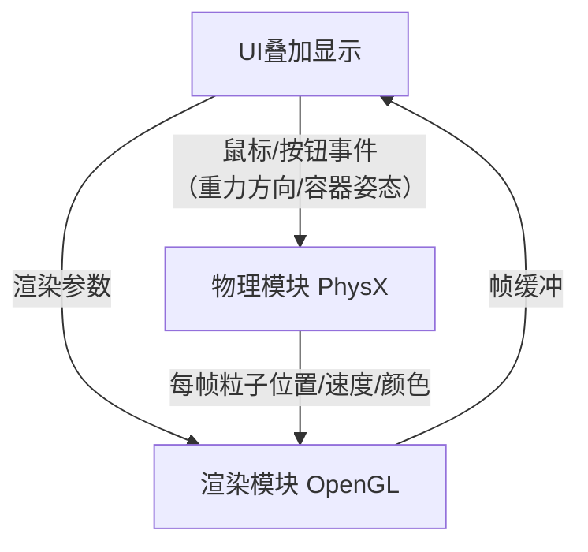
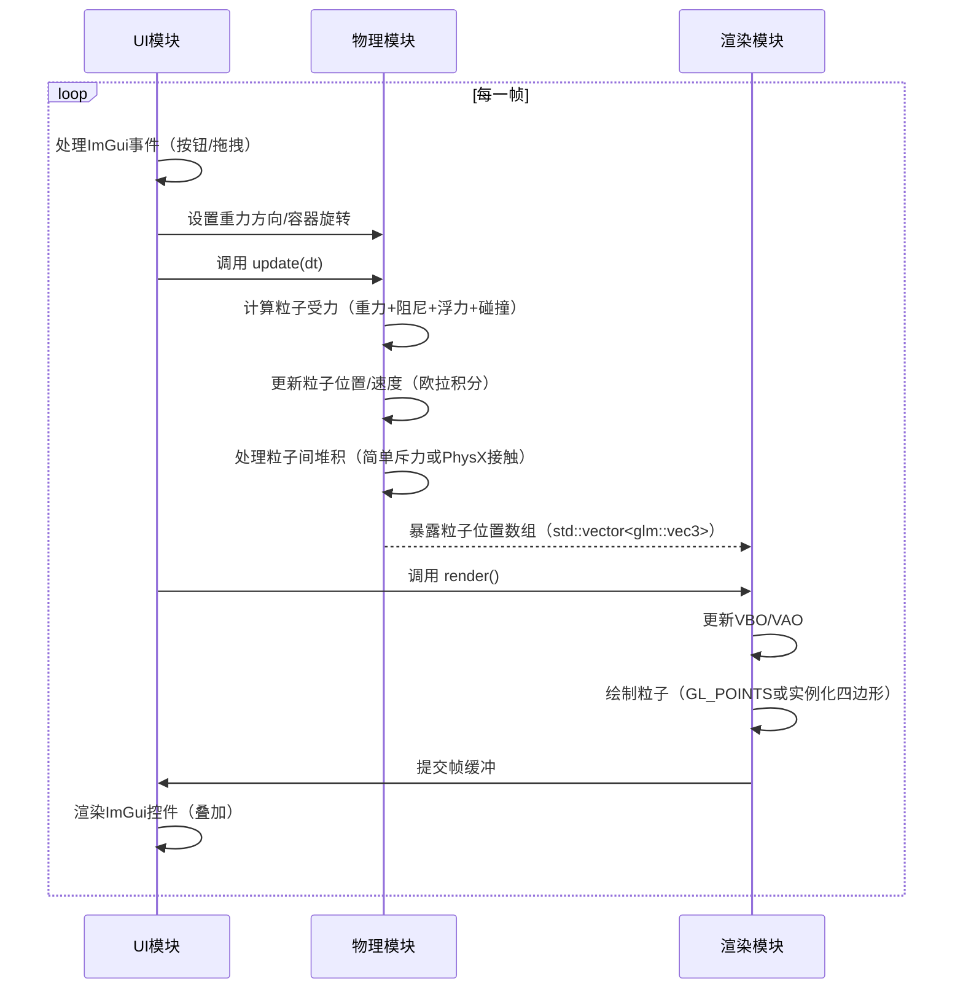
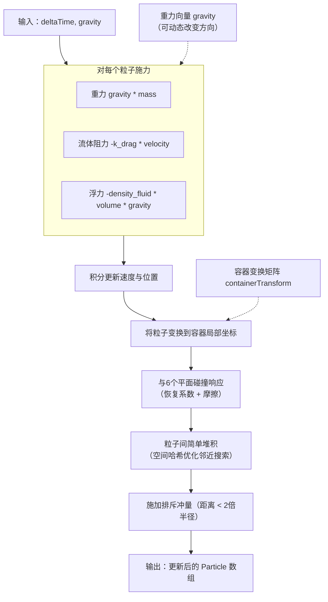
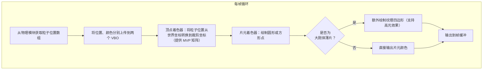

# 项目说明
不借助集成游戏引擎，搭建一个简易的流沙麻将小游戏 

# 游戏玩法
在扁形瓶（长6cm，宽3.7cm，厚0.2cm）中填满流沙油（略微粘稠的液体） 
再填入若干流沙粒子（直径0.02cm）。 
通过摇晃、倒置瓶子，观察流沙的沉降、堆积和随液体流动的视觉效果。 
还可以增加亮片功能，即体积稍大、具有特定形状的薄片状刚体，重点突出其反光特性。 

# 模块划分
模块采用单向依赖+回调通知的架构，UI作为控制入口，物理模块独立模拟，渲染模块仅负责可视化。 

## 物理模块（physx5）
- 职责：维护粒子（闪粉）的物理状态，处理与容器边界的碰撞、粒子间接触（堆积）、流体阻尼（粘稠液体效果），响应重力方向变化。
- 依赖：仅依赖UI模块获取当前重力方向，输出粒子位置数组供渲染模块读取。
- 交互方式：提供`update(deltaTime)`推进模拟，提供`getParticleData`返回只读粒子数据指针。

## 渲染模块（Opengl+glfw+glew+glm+stb_image）
- 职责：管理着色器、顶点缓冲，绘制容器边框和所有粒子，接收UI传递的相机视角参数。
- 依赖：每帧从物理模块获取粒子位置，转换为GPU缓冲后绘制。
- 交互方式：暴露`render()`方法，由UI模块的主循环调用。

## UI模块（ImGui）
- 职责：接收用户输入，调节模拟参数，控制模拟启停。
- 依赖：调用物理模拟的接口更新重力方向、容器变换矩阵；调用渲染模块的接口更新相机视角。
- 交互方式：通过ImGui窗口嵌入OpenGL视口，不直接持有渲染数据。

# 数据流动模型

## 各个模块之间的数据流动

## 物理模块内的数据流动

## 渲染模块内的数据流动

# 开发流程

> 20260419 
> 项目构思，环境搭建，测试基础窗口功能。 
> 在NuGet里直接安装glfw、glew、glm、stb_image。 
> PhysX5在GitHub下载源码，并在StaticDebug模式下编译。 
> 注意设定头文件路径、库文件路径，尤其注意设定路径时的项目模式应该保持一致为StaticDebug。 
> ImGui在GitHub下载源码，并将需要用到的文件拷贝到项目中。 

> 20260420 
> 构建物理模型。 
> 完全没有必要使用SPH（光滑粒子流体动力学）方法。 
> 只把粒子当做质点，实现粒子间的法向斥力和切向摩擦力。 
> 把流体当做场，因为容器非常扁（厚度仅长宽的1/20） 
> 用单层纳维 - 斯托克斯方程计算流体的流动速度场。 
> 用拖曳力模型把速度场施加到粒子上。 
> 只考虑单向耦合（忽略粒子对流体的影响） 
> $v_{new} = v_{old} + \alpha * (v_{fluid} - v_{old})$ 
> 不用光照模拟，那太吃性能。 
> 用柏林噪声闪烁贴图，各个粒子的发光参数在2D柏林噪声图上随机平滑移动。 
> 对噪声值取exp，只在一定阈值以上时高光，实现闪粉的闪烁效果。 
> 再用HDR + Bloom（泛光）增强闪烁的视觉效果。 